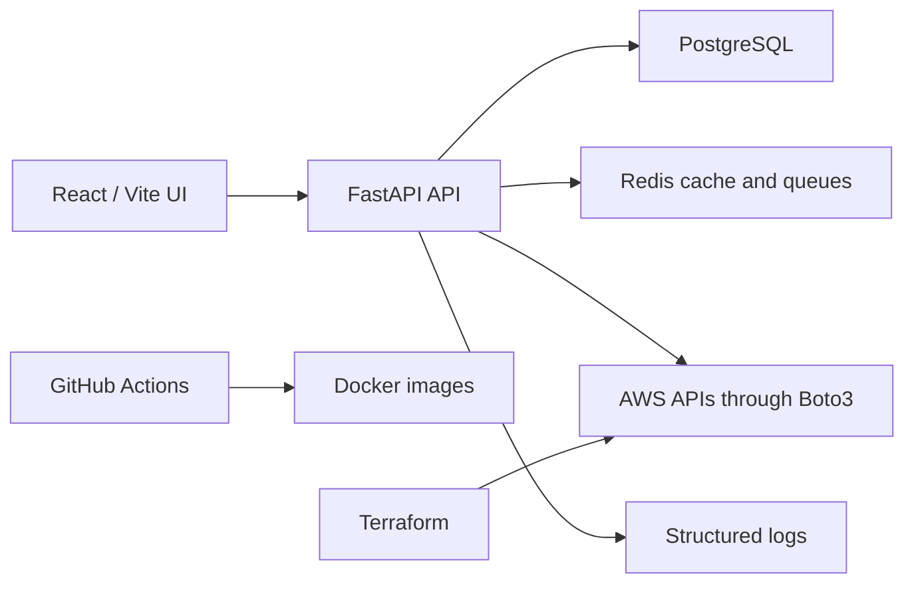

# CloudOps Hub Architecture

CloudOps Hub is organized as a production-style SaaS monorepo.

Core layers:

- `api`: route handlers, authorization, validation, pagination boundaries.
- `services`: AWS and business workflow logic.
- `models`: normalized SQLAlchemy entities.
- `schemas`: Pydantic request and response contracts.
- `database`: SQLAlchemy session and Alembic migration support.
- `infra`: Docker Compose and Terraform for deployable infrastructure.
