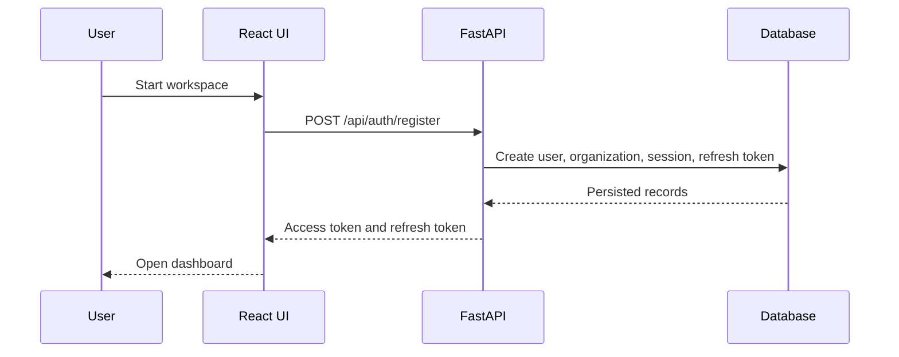
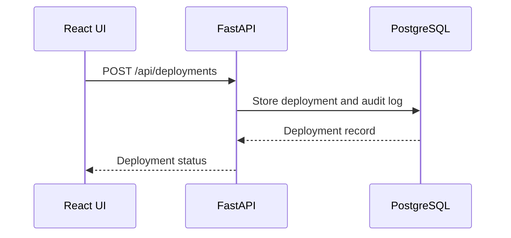

# Sequence Diagrams

## Authentication

```mermaid
sequenceDiagram
  participant U as User
  participant UI as React UI
  participant API as FastAPI
  participant DB as Database
  U->>UI: Start workspace
  UI->>API: POST /api/auth/register
  API->>DB: Create user, organization, session, refresh token
  DB-->>API: Persisted records
  API-->>UI: Access token and refresh token
  UI-->>U: Open dashboard
```

## Deployment

```mermaid
sequenceDiagram
  participant UI as React UI
  participant API as FastAPI
  participant DB as PostgreSQL
  UI->>API: POST /api/deployments
  API->>DB: Store deployment and audit log
  DB-->>API: Deployment record
  API-->>UI: Deployment status
```
